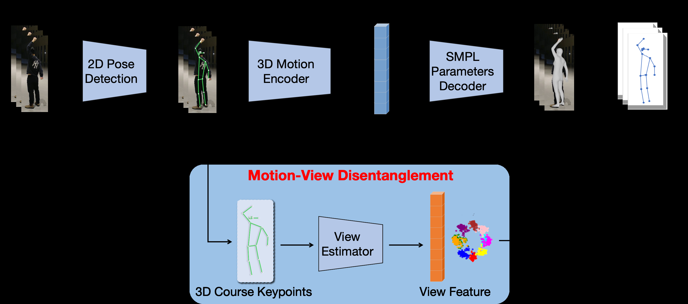

# MoViD: View-Invariant 3D Human Pose Estimation via Motion-View Disentanglement

This is the repository for the SenSys '26 paper "MoViD: View-Invariant 3D Human Pose Estimation via Motion-View Disentanglement".

[Paper DOI](https://doi.org/10.1145/3774906.3802786) | [Paper PDF](https://dl.acm.org/doi/pdf/10.1145/3774906.3802786) | [Demo Video](https://youtu.be/L4Bx_LvPXB8) | [Camera-Ready Guide](docs/CAMERA_READY.md)

## Introduction

MoViD is a viewpoint-invariant 3D human pose estimation framework for robust human motion understanding under large camera changes, severe occlusions, and edge deployment constraints. Instead of treating viewpoint variation as a nuisance handled only through more data, MoViD explicitly estimates and disentangles view information from motion features to produce view-invariant pose representations.

The framework combines a dedicated view estimator, motion-view orthogonal projection, physics-enhanced contrastive alignment, and a frame-by-frame view-aware inference strategy for edge deployment. Across nine public datasets and two newly collected datasets, MoViD reduces pose estimation error by over 24.2% versus prior state-of-the-art methods, remains robust with 60% less training data, and reaches real-time inference at 15 FPS on NVIDIA edge devices.

This repository is organized as the camera-ready code release. It keeps the maintained training pipeline, offline inference pipeline, stream inference pipeline, Python API wrapper, and edge-side runtime in a single public tree.

## System Overview



MoViD introduces four main components for view-invariant and edge-ready 3D pose estimation:

- `View Estimator`: predicts viewpoint information from intermediate 3D pose features by modeling key joint relationships.
- `Motion-View Orthogonal Projection`: explicitly disentangles motion and view features so the motion branch remains stable across camera changes.
- `Physics-Enhanced Contrastive Alignment`: improves cross-view consistency with contrastive supervision and motion-aware physical constraints.
- `View-Aware Edge Inference`: runs frame-by-frame inference and adaptively enables flip refinement only when the estimated viewpoint requires it.

## Quick Start

### Main Repository

#### 1. Clone the repository

```bash
git clone <your-movid-repo-url> --recursive
cd MoViD
```

#### 2. Install the environment

```bash
bash scripts/setup/install_environment.sh
```

If you also want action recognition support:

```bash
bash scripts/setup/install_pyskl.sh
python tools/action/download_stgcn_model.py
```

#### 3. Download demo assets and default checkpoints

```bash
bash scripts/setup/fetch_demo_data.sh
```

This script downloads the demo video, default checkpoints, and required body-model assets. It will prompt for SMPL / SMPLify credentials when needed.

#### 4. Run offline inference

```bash
python demo.py \
  --video examples/demo_video.mp4 \
  --output_pth output/demo \
  --visualize
```

To run the helper with action recognition:

```bash
bash scripts/demo/run_demo_with_har.sh examples/demo_video.mp4 output/demo_har
```

#### 5. Run stream inference

```bash
python demo.py \
  --video examples/demo_video.mp4 \
  --mode stream \
  --stream_window_size 10 \
  --output_pth output/stream \
  --visualize
```

#### 6. Run the API wrapper

```bash
python movid_api.py \
  --video examples/demo_video.mp4 \
  --output_dir output/api_demo \
  --visualize
```

#### 7. Train and evaluate

Train:

```bash
python train.py --cfg configs/yamls/stage2.yaml
```

If multi-worker dataloaders are restricted:

```bash
python train.py --cfg configs/yamls/stage2.yaml NUM_WORKERS 0
```

Evaluate:

```bash
bash scripts/eval/run_eval.sh 3dpw checkpoints/movid_vit_w_3dpw.pth.tar
```

### Edge Runtime

Offline edge inference:

```bash
python MoViD_edge/demo.py \
  --video examples/demo_video.mp4 \
  --output_pth output/edge_demo \
  --visualize
```

Real-time / streaming edge inference:

```bash
python MoViD_edge/real_time.py \
  --video realsense \
  --output_pth output/edge_rt \
  --visualize \
  --max_frames 1000
```

Flip-eval streaming:

```bash
python MoViD_edge/real_time.py \
  --video realsense \
  --output_pth output/edge_rt_flip \
  --visualize \
  --flip_eval \
  --flip_select all \
  --max_frames 1000
```

## Repository Layout

```text
.
|-- configs/
|-- docs/
|   |-- assets/
|   |-- guides/
|   |-- API.md
|   |-- CAMERA_READY.md
|   |-- DATASET.md
|   `-- INSTALL.md
|-- lib/
|-- models/
|   `-- action_recognition/
|-- scripts/
|   |-- demo/
|   |-- eval/
|   |-- setup/
|   `-- train/
|-- tools/
|   |-- action/
|   |-- data/
|   `-- eval/
|-- MoViD_edge/
|-- third-party/
|-- batch_eval.py
|-- demo.py
|-- movid_api.py
`-- train.py
```

## Documentation

- [Camera-Ready Guide](docs/CAMERA_READY.md)
- [Installation](docs/INSTALL.md)
- [Dataset Preparation](docs/DATASET.md)
- [Python API](docs/API.md)
- [Action Recognition Guide](docs/guides/action-recognition.md)
- [HAR Quick Start](docs/guides/quick-start-har.md)
- [MoViD Edge Guide](MoViD_edge/README.md)

## Release Notes

- Large runtime artifacts such as datasets, checkpoints, logs, outputs, videos, and TensorRT engines are intentionally excluded from Git.
- The maintained edge deployment workflow lives under `MoViD_edge/`, while the full training and evaluation pipeline remains at the repository root.
- Upstream dependencies such as DPVO and ViTPose stay under `third-party/` with their original licenses and attribution.

## Citation

If you use MoViD in your research, please cite:

```bibtex
@inproceedings{liu2026movid,
  title={MoViD: View-Invariant 3D Human Pose Estimation via Motion-View Disentanglement},
  author={Liu, Yejia and Jiang, Hengle and Liu, Haoxian and Huang, Runxi and Ouyang, Xiaomin},
  booktitle={Proceedings of the ACM/IEEE International Conference on Embedded Artificial Intelligence and Sensing Systems},
  series={SenSys '26},
  year={2026},
  doi={10.1145/3774906.3802786}
}
```
